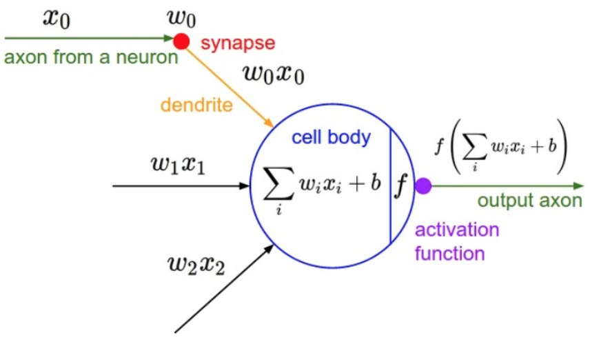
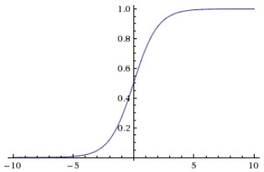
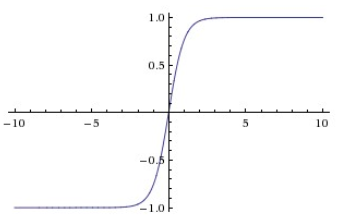
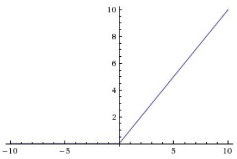
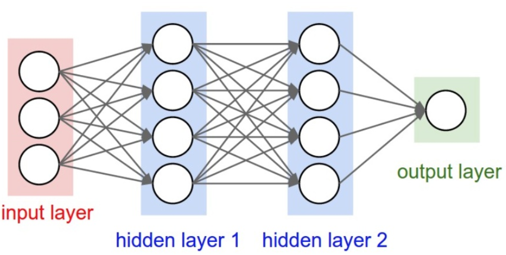

# 神经网络建模

## 神经元模型

在**神经元**(Neural)模型中，信号$x$沿着连接神经元之间的**突触**(Synapse)以强度$w$与输入神经元中接收信号的部分**树突**(Dendrite)进行乘法交互$$Wx+b$$这个被处理的信号通过**激活函数**(Activation function)$\sigma$计算激活率，如果大于某个阈值，神经元将被激活，并将信号通过突触传递给神经网络中的下一个神经元，如图

## 激活函数

### sigmoid

$$\sigma(x)=\frac{1}{1+e^{-x}}$$

sigmoid函数将$x$压缩到$[0, 1]$之间，如图

sigmoid并不是一个好的激活函数选择

* 假设输入的$x$较大或较小时，sigmoid的激活值会接近0或1，此时sigmoid的局部梯度几乎为0$$\sigma'(x)=\sigma(x)\left(1-\sigma(x)\right)$$使得反向传播时整个损失函数的梯度都为0，这样就导致神经元饱和，网络几乎不再学习

* sigmoid函数的输出不是以零为中心的，这会导致梯度下降的效率降低

### tanh

$$\text{tanh(x)}=\frac{e^x-e^{-x}}{e^x+e^{-x}}$$

tanh函数将$x$压缩到$[-1, 1]$之间，如图

与sigmoid函数一样，tanh函数一样存在神经元饱和的问题，但它是以零为中心的

### ReLU

$$f(x)=\max(0, x)$$

**ReLU**函数(Rectified linear unit)是一个关于0的阈值，如图

1. ReLU不存在饱和问题，并且计算简单，能快速收敛，是激活函数的最佳选择

2. 某些情况下，会导致梯度被更新到一种特别的状态，这种状态下神经元将无法被任何数据再次激活，梯度将变成0，而这个单元在训练中将不可逆转的死亡

    这通常是因为学习率设置得太高，降低学习率可以减少这种情况发生的概率

### Maxout

为了解决ReLU函数会导致神经元死亡的缺点，Maxout函数对ReLU和Leaky ReLU进行了一般化归纳，即$$f(x)=\max(W_1x+b_1, W_2x+b_2)$$但是相比之下，它对每个神经元的参数增加了一倍，导致整体参数数量激增

因此ReLU仍然是激活函数的最佳选择

## 分层网络结构

1. **神经网络**(Neural network)由神经元的集合组成，神经元之间以无环图的形式进行连接

2. 神经网络中的神经元是分层的，最常见的层是**全连接层**(Fully-connected layer)

    全连接层中神经元与其前后两层的神经元是成对连接的，但是同一个全连接层内的神经元之间没有连接，如图

    

3. 输出层和其他层不同，是没有激活函数的，或者可以认为它的激活函数是一个线性相等函数，这是因为输出层通常用于表示分类的评分值

## 通用函数近似器

1. 神经网络包含一系列线性函数层，层与层之间由非线性函数连接堆叠组成

    **前向传播**(Forward propagation)将样本特征映射为对每个分类的评分

    **反向传播**(Backward propagation)根据损失反向推导梯度，来实现参数更新

2. 神经网络可以近似任何连续函数，在实践中通常使用3层神经网络，它的表现相对更好，继续加深层数很少有太大帮助

    但在卷积神经网络中，深度是一个十分重要的因素

3. 更大的网络总是更好的，但是更大的模型需要更强的惩罚，如正则化、Dropout等，否则会导致过拟合