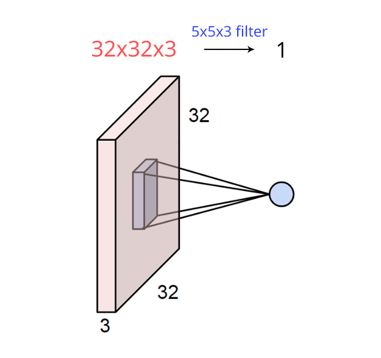
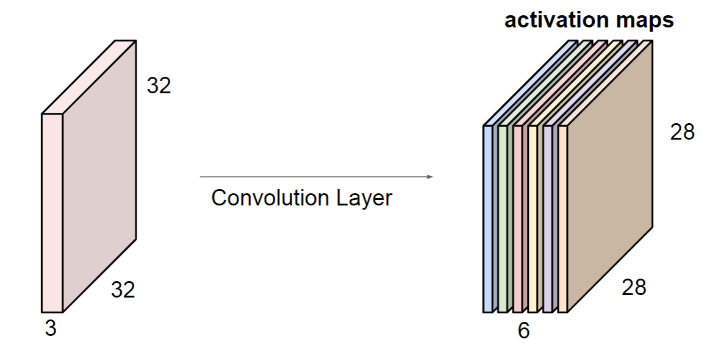
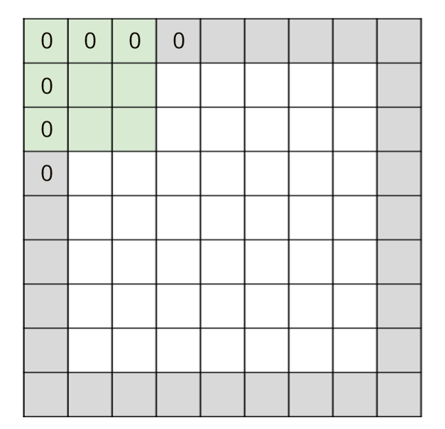
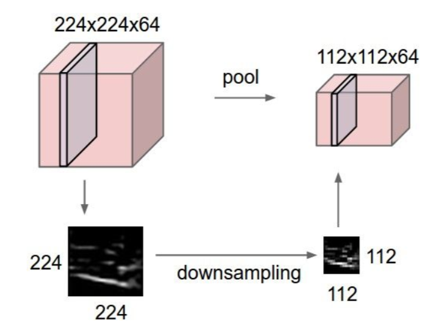
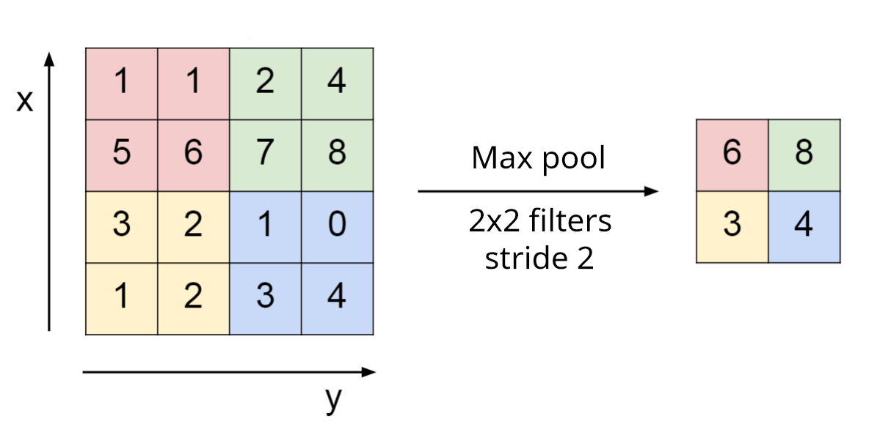

# 卷积神经网络

## 概述

1. 随着硬件计算能力的大幅提升和AlexNet在ILSVRC12中的登顶，**卷积神经网络**(Convolution Neural Network, CNN)成为计算机视觉领域的一个流行解决方案

2. 一个典型的CNN架构如下图

    

    $$\text{Input}\rightarrow\big[\left(\text{Conv}\rightarrow\text{ReLU}\right)*n\rightarrow\text{Pool}?\big]*m\rightarrow\left(\text{FC}\rightarrow\text{ReLU}\right)*k\rightarrow\text{Softmax}$$

    其中$n$不超过3，$m$在深度网络中很大，$k$通常选择1或者2

3. 一个CNN中包括以下层

    * **卷积层**(Convolution layer)

    * **池化层**(Pooling layer)

    * 全连接层

## 卷积

1. 在卷积层中，不与上一层的所有神经元全部连接，而是使用**卷积核**(Filter)与上一层进行局部连接，计算激活值

    

    卷积核的尺寸为$F\times F\times D$

    * $F\times F$被称为**感受野**(Receptive field)，是一个超参数

    * 深度$D$与输入的深度保持一致

2. 一个卷积层使用$K$个感受野相同的卷积核以**步长**(Stride)$S$进行滑动，与输入特征的局部区域进行点积，得到输入的一个**激活映射**(Activation map)

    

    输出的激活映射深度为该层卷积核的个数$K$，是一个超参数

3. 卷积核被超出边界进行扫描，超出边界的部分填充0，这种方式被称为**零填充**(Zero-padding)，它可以保持输入的尺寸

    

4. 记输入的特征尺寸为$W_1\times H_1\times D_1$，以及边界填充的数量$P$，那么输出尺寸为$W_2\times H_2\times D_2$$$\begin{aligned}W_2&=(W_1-F+2P)/S+1\\H_2&=(H_1-F+2P)/S+1\\D_2&=K\end{aligned}$$其中$S$的选择必须确保卷积核的滑动与平面尺寸相适配，即能够被$S$整除

## 池化

1. 池化层对输入特征进行降采样，从而降低参数的数量

    

    池化只对平面进行降采样，而不对深度进行降采样

2. 最常见的方法是**最大池化**(Max pooling)，使用一个2x2或3x3的卷积核以2的步长扫描全部特征，只是这里的卷积核不进行数量积运算而是取扫描范围内的最大值

    

3. 池化层不会进行零填充

4. 记输入的特征尺寸为$W_1\times H_1\times D_1$，那么输出尺寸为$W_2\times H_2\times D_2$

    其中$$\begin{aligned}W_2&=(W_1-F)/S+1\\H_2&=(H_1-F)/S+1\\D_2&=D_1\end{aligned}$$

5. 一个流行的趋势是在卷积层中使用更大的步长降采样来替代池化层

## 流行CNN架构

### AlexNet

### VGG

### GoogleNet

### ResNet