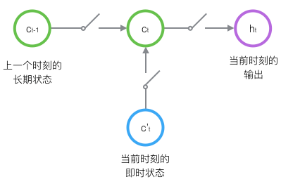
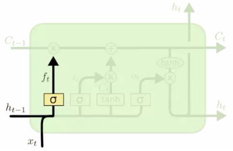

# 循环神经网络

## 循环神经网络

1. **循环神经网络**(Recurrent Neural Network, RNN)是一种节点连接成环的神经网络模型，常用于处理动态时序如**自然语言**(Natural Language)

2. 根据输入与输出序列的长度可以分为三类

    * 一对多

        

        **图像标注**(Image captioning)：图片 -> 语言序列

    * 多对一

        

        **情感分析**(Sentiment classification)：语言序列 -> 情感

    * 多对多

        

        **机器翻译**(Manchine translation)：语言序列 -> 语言序列

3. RNN中的隐层会维护一个**内部隐藏态**(Internal hidden state)，该状态记录了之前时序的信息

    RNN每次读取新输入时会更新该状态，并根据该状态预测输出

### 前向传播

1. 前向传播公式

    

        

            
        

    

    $$\begin{aligned}\\s_{t}&=\phi_{W, U}(s_{t-1},x_t)\\&=\tanh(Ws_{t-1}+Ux_t)\\o_t&=\varphi(Vs_t)\\&=\text{Softmax}(Vs_t)\\\\\end{aligned}$$

    其中$s_{t-1}$存储上一个时序的隐藏态，$s_t$存储当前时序的隐藏态

2. 将每次时序的传播展开，可以得到RNN的计算图

    

### 时序反向传播

1. 求解梯度$\frac{\partial L}{\partial V}$

    $$\begin{aligned}\frac{\partial L}{\partial V}&=\sum_{t=1}^n\frac{\partial L_t}{\partial o_t}\frac{\partial o_t}{\partial V}\\&=\sum_{t=1}^n\frac{\partial L_t}{\partial o_t}\frac{\partial o_t}{\partial Vs_t}\frac{\partial Vs_t}{\partial V}\\&=\sum_{t=1}^n\frac{\partial L_t}{\partial o_t}\varphi'(Vs_t)s_t\end{aligned}$$

2. 求解梯度$\nabla_W$和$\nabla_U$，记$z_t=Ws_{t-1}+Ux_t$

    考虑单步梯度$\nabla_Ws_t$

    $$\begin{aligned}\nabla_Ws_t&=\frac{\partial s_t}{\partial z_t}\frac{\partial z_t}{\partial W}\\&=\frac{\partial s_t}{\partial z_t}s_{t-1}\end{aligned}$$

    根据计算图中的梯度流向可知，$\nabla_{s_{t}}$由每步损失的梯度和下一步状态的梯度组成

    $$\nabla_{s_{t}}=\frac{\partial L_t}{\partial s_t}+\frac{\partial s_{t+1}}{\partial s_t}\nabla_{s_{t+1}}$$

    这种沿着时间$t$进行梯度传播的方式称为**时序反向传播**(Back Propagation Through Time, BPTT)

    由链式法则得到$$\begin{aligned}\nabla_W&=\sum_{t=1}^n\nabla_{s_{t}}\nabla_Ws_t\\&=\sum_{t=1}^n\frac{\partial L_t}{\partial z_t}s_{t-1}+\frac{\partial s_{t+1}}{\partial z_t}s_{t-1}\nabla_{s_{t+1}}\\&=\sum_{t=1}^n\frac{\partial L_t}{\partial z_t}s_{t-1}+\frac{\partial L_{t+1}}{\partial z_t}s_{t-1}+\dots+\frac{\partial L_n}{\partial z_t}s_{t-1}\\&=\sum_{t=1}^n\sum_{k=t}^n\frac{\partial L_k}{\partial z_k}\frac{\partial z_k}{\partial z_t}s_{t-1}\end{aligned}$$

    同理$$\begin{aligned}\nabla_U&=\sum_{t=1}^n\nabla_{s_t}\nabla_Us_t\\&=\sum_{t=1}^n\sum_{k=t}^n\frac{\partial L_k}{\partial z_k}\frac{\partial z_k}{\partial z_t}x_t\end{aligned}$$

3. BPTT中，梯度会随着时间不断累积

    $$\begin{aligned}\frac{\partial z_t}{\partial z_{t-1}}&=\frac{\partial z_t}{\partial s_{t-1}}\frac{\partial s_{t-1}}{\partial z_{t-1}}\\&=W\phi'(z_{t-1})\\\frac{\partial z_k}{\partial z_t}&=\frac{\partial z_k}{\partial z_{k-1}}\frac{\partial z_{k-1}}{\partial z_{k-2}}\dots\frac{\partial z_{t+1}}{\partial z_t}\\&=W^{k-t}\prod_{i=t}^{k-1}\phi'(z_i)\end{aligned}$$

    这种指数级别的累计会导致梯度消失或梯度爆炸

    为了解决这个问题，引入了LSTM和GRU模型来改善RNN模型

## LSTM

1. **长短期记忆**(Long Short-term Memory, LSTM)是一种特殊的RNN，在长序列的训练上有着良好的表现

2. 原始RNN的隐层中只有一个隐藏态$h_t$，它对短期输入十分敏感

    在LSTM中引入了一个保存长期状态的$c_t$，来解决长序列训练时的梯度消失或梯度爆炸的问题

3. 为了控制长期状态$c_t$，LSTM使用**门**(gate)开关来控制值的向前传递

    

    门是一种将输入映射到$(0, 1)$的函数，通常使用sigmoid函数

### 前向传播

1. 遗忘门f决定是否丢弃的信息

    

    $$\begin{aligned}\\\\\\f_t=\sigma(W_fh_{t-1}+U_fx_t+b_f)\\\\\\\\\end{aligned}$$

    输入门i决定是否写入信息，$\tilde{c}_t$表示当前时序的新信息

    

    $$\begin{aligned}\\\\i_t&=\sigma(W_ih_{t-1}+U_ix_t+b_i)\\\\\tilde{c}_t&=\tanh(W_ch_{t-1}+U_cx_t+b_c)\\\\\\\end{aligned}$$

    f门控制上一时序$c_{t-1}$丢弃的信息，i门控制$\tilde{C}_t$写入的信息

    

    $$\begin{aligned}\\\\\\c_t=f_t\odot c_{t-1}+i_t\odot\tilde{c}_t\\\\\\\\\end{aligned}$$这里的$\odot$表示逐元素相乘

    输出门o决定是否输出信息

    

    $$\begin{aligned}\\\\o_t&=\sigma(W_oh_{t-1}+U_ox_t+b_o)\\\\h_t&=o_t\odot\tanh(c_t)\\\\\\\end{aligned}$$

2. 综上

    $$\begin{aligned}\begin{pmatrix}i \\ f \\ o \\ \tilde{c}\end{pmatrix}&=\begin{pmatrix}\sigma \\ \sigma \\ \sigma \\ \tanh\end{pmatrix}(Wh_{t-1}+Ux_t)\\c_t&=f\odot c_{t-1}+i\odot \tilde{c}\\h_t&=o\odot\tanh(c_t)\end{aligned}$$

### 时序反向传播

其中$$\begin{aligned}\sigma'(x)&=\sigma(x)(1-\sigma(x))\\\tanh'(x)&=1-\tanh^2(x)\\\nabla_{h_t}&=\frac{\partial L_t}{\partial h_t}+\frac{\partial h_{t+1}}{\partial h_t}\nabla_{h_{t+1}}\\\nabla_{c_t}&=\frac{\partial c_{t+1}}{\partial c_t}\nabla_{c_{t+1}}\end{aligned}$$

1. 求解$\nabla_{W_o}$和$\nabla_{U_o}$

    $$\begin{aligned}\nabla_{W_o}&=\sum_{t=1}^n\nabla_{h_t}\frac{\partial h_t}{\partial o_t}\frac{\partial o_t}{\partial W_o}\\&=\sum_{t=1}^n\nabla_{h_t}\nabla_{W_o}o_t\tanh(c_t)\\&=\sum_{t=1}^n\nabla_{h_t}\sigma'(o_t)h_{t-1}\tanh(c_t)\\\nabla_{U_o}&=\sum_{t=1}^n\nabla_{h_t}\frac{\partial h_t}{\partial o_t}\frac{\partial o_t}{\partial U_o}\\&=\sum_{t=1}^n\nabla_{h_t}\nabla_{U_o}o_t\tanh(c_t)\\&=\sum_{t=1}^n\nabla_{h_t}\sigma'(o_t)x_t\tanh(c_t)\end{aligned}$$

2. 求解$\nabla_{W_i}$和$\nabla_{U_i}$

    $$\begin{aligned}\nabla_{W_i}&=\sum_{t=1}^n\nabla_{c_t}\frac{\partial c_t}{\partial i_t}\frac{\partial i_t}{\partial W_i}\\&=\sum_{t=1}^n\nabla_{c_t}\nabla_{W_i}i_t\tilde{c}_t\\&=\sum_{t=1}^n\nabla_{c_t}\sigma'(i_t)h_{t-1}\tilde{c}_t\\\nabla_{U_i}&=\sum_{t=1}^n\nabla_{c_t}\frac{\partial c_t}{\partial i_t}\frac{\partial i_t}{\partial U_i}\\&=\sum_{t=1}^n\nabla_{c_t}\nabla_{U_i}i_t\tilde{c}_t\\&=\sum_{t=1}^n\nabla_{c_t}\sigma'(i_t)x_{t}\tilde{c}_t\end{aligned}$$

    $\nabla_{W_{f,c}}$和$\nabla_{U_{f,c}}$同理

## GRU

**门控循环单元**(Gate Recurrent Unit, GRU)是LSTM的一种变体，对LSTM进行了简化

$$\begin{aligned}r_t&=\sigma(W_r[h_{t-1}, x_t])\\z_t&=\sigma(W_z[h_{t-1}, x_t])\\\tilde{h}_t&=\tanh(W_h[r_t\odot h_{t-1}, x_t])\\h_t&=z_t\odot h_{t-1}+(1-z_t)\odot\tilde{h}_t\end{aligned}$$