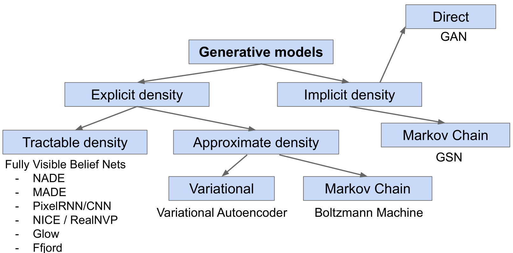
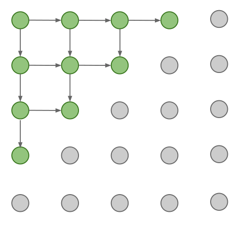
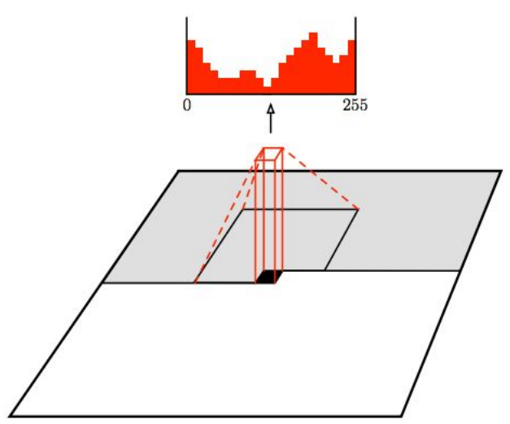
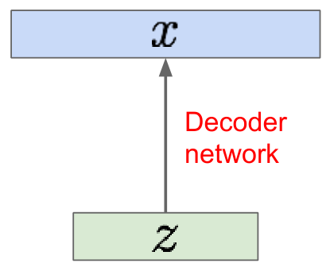
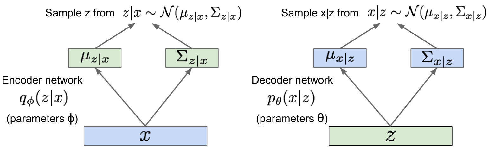
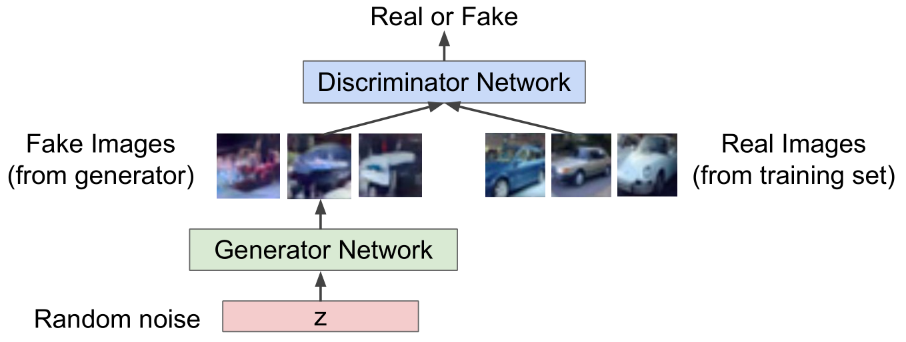

# 生成模型

## 概述

1. **生成模型**(Generative model)是一类**无监督学习**(Unsupervised learning)

    给定训练数据$p_{data}(x)$，从相同的数据分布中生成尽可能相似的新样本$p_{model}(x)$

2. 生成模型要解决的核心问题是**密度估计**(Density estimation)

    根据使用密度估计的方式可以分为两类

    * **显式密度估计**(Explicit density estimation)：显式定义并求解$p_{model}(x)$

    * **隐式密度估计**(Implicit density estimation)：不显式定义$p_{model}(x)$，而是从中生成样本的模型

    

## 全可见信念网络

1. **全可见信念网络**(Fully visible belief network, FVBN)属于显式密度模型，通过链式法则将数据的似然分解为一维密度分布的乘积

    $$p(x)=\prod_{i=1}^np(x_i|x_1,\dots,x_{i-1})$$

    数据的分布通常十分复杂，会使用一个神经网络来表达这个概率分布函数

2. 为了求解目标模型$p_{model}(x)$，最大化训练数据在该定义下的似然$p(x)$

### Pixel RNN

Pixel RNN从角落开始一个接一个地生成像素，使用RNN/LSTM对序列中像素的依赖关系进行建模

### Pixel CNN

Pixel CNN使用CNN替代RNN对依赖关系进行建模

具体做法是将要生成像素周围的已生成像素传递给CNN来生成像素，最小化生成像素与真实像素之间的损失来最大化似然

## 变分自编码器

1. **变分自编码器**(Variational Autoencoder, VAE)属于显式密度模型，它定义了一个不可解的密度函数，通过优化密度函数下界来近似求解目标模型$$p_\theta(x)=\int p_\theta(z)p_\theta(x|z)dz$$其中$z$是一个表征训练数据中变化因子多少的隐变量

2. 基于自编码器的思想，在先验分布$p_\theta(z)$上生成模型$p_{model}(x)$，并用神经网络来表达这个变换，形成解码网络$p_\theta(x|z)$

    

    因此似然函数可以写作$$p_\theta(x)=\int p_\theta(z)p_\theta(x|z)dz$$但是为每一个$z$对$p_\theta(x|z)$进行积分是不可解的，解决方法是引入编码网络$q_\phi(x|z)$对$p_\theta(x|z)$进行估计

    

    计算模型的对数似然

    $$\begin{aligned}\log p_\theta(x)&=\mathbb{E}_z\left[\log p_\theta(x^{(i)})\right]\\&=\mathbb{E}_z\left[\log\frac{p_\theta(x^{(i)}|z)p_\theta(z)}{p_\theta(z|x^{(i)})}\right]\\&=\mathbb{E}_z\left[\log\frac{p_\theta(x^{(i)}|z)p_\theta(z)}{p_\theta(z|x^{(i)})}\frac{q_\phi(z|x^{(i)})}{q_\phi(z|x^{(i)})}\right]\\&=\mathbb{E}_z\left[\log p_\theta(x^{(i)}|z)\right]-\mathbb{E}_z\left[\log\frac{q_\phi(z|x^{(i)})}{p_\theta(z)}\right]+\mathbb{E}_z\left[\log\frac{q_\phi(z|x^{(i)})}{p_\theta(z|x^{(i)})}\right]\\&=\mathbb{E}_z\left[\log p_\theta(x^{(i)}|z)\right]-D_{KL}\left[q_\phi(z|x^{(i)})||p_\theta(z)\right]+D_{KL}\left[q_\phi(z|x^{(i)})||p_\theta(z|x^{(i)})\right]\\&\ge \mathbb{E}_z\left[\log p_\theta(x^{(i)}|z)\right]-D_{KL}\left[q_\phi(z|x^{(i)})||p_\theta(z)\right]\\&=\mathcal{L}(x^{(i)},\theta,\phi)\end{aligned}$$

    其中$D_{KL}$是KL散度项，表明两个分布的相似程度，是一个大于等于0的项

    因此为了近似求解模型，最大化对数似然函数的下界，即

    $$\theta^*,\phi^*=\arg\max_{\theta,\phi}\sum_{i=1}^N\mathcal{L}(x^{(i)},\theta,\phi)$$

## 生成对抗网络

1. **对抗生成网络**(Generative Adversarial Network, GAN)采用二人博弈的方法从训练数据的分布中进行采样生成$p_{model}(x)$，而不求解任何密度函数

2. GAN的博弈双方由两个网络组成

    * **辨别器网络**(Discriminator Network)：分辨图片是生成的还是真实的

    * **生成器网络**(Generator Network)：将随机噪音输入生成图片并尝试欺骗辨别器网络

    

3. 通过minimax博弈公式联合训练这两个网络

    $$\min_{\theta_g}\max_{\theta_d}\left[\mathbb{E}_{x\sim p_{data}(x)}\log D_{\theta_d}(x)+\mathbb{E}_{z\sim p(z)}\log(1-D_{\theta_d}(G_{\theta_g}(z)))\right]$$

    其中辨别器$D$希望最大化目标函数，使$D(x)=1$而$D(G(x))=0$，即正确地分辨真伪
    生成器$G$希望最小化目标函数，使$D(G(z))=1$，即欺骗辨别器生成图片$G(z)$是真的

4. 将目标函数分解为两部分交替训练这两个网络

    * 对辨别器进行**梯度上升**

        $$\max_{\theta_d}\left[\mathbb{E}_{x\sim p_{data}(x)}\log D_{\theta_d}(x)+\mathbb{E}_{z\sim p(z)}\log(1-D_{\theta_d}(G_{\theta_g}(z)))\right]$$

    * 对生成器进行**梯度下降**

        $$\min_{\theta_g}\mathbb{E}_{z\sim p(z)}\log(1-D_{\theta_d}(G_{\theta_g}(z)))$$

    由于生成器目标函数的形状，导致了生成器初期只能生成质量不高的数据但获得的梯度却很小

    一个解决方法是转换生成器的目标函数，对其**梯度上升**来最大化辨别器出错的可能

    $$\max_{\theta_g}\mathbb{E}_{z\sim p(z)}\log D_{\theta_d}(G_{\theta_g}(z))$$