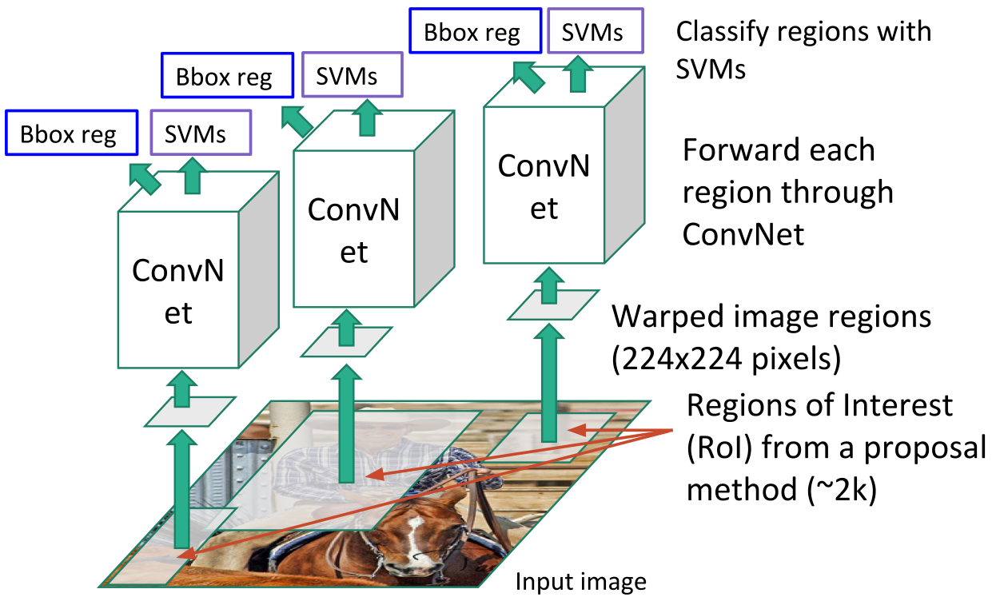

# 计算机视觉任务概述

## 概述

1. 计算机视觉的任务包含但不限于

    * **分类**(Classification)

        

    * **图像标注**(Image Captioning)

        

    * **语义分割**(Semantic Segmentation)

        

    * **目标检测**(Object Detection)

        

    * **实例分割**(Instance Segmentation)

        

2. 这些任务最前沿的解决方案都是建立在图像分类的基础上，对CNN进行补充或者修改

## 图像标注

1. 图像标注是一种根据输入图像输出描述文字的技术

2. 核心思想是将一张图片输入去除了最后用于分类的全连接层的CNN，并将得到的特征进行线性映射作为RNN初始的内部态，与输入一起不断循环得到输出

## 语义分割

1. 语义分割是一种为图像中每个像素都进行分类的技术

    但语义分割不会区分同一类中的不同实例

    

    

2. 核心思想是让输入图片通过一个CNN得到一个输入图片尺寸相同的输出，输出特征代表该位置处元素的分类标签

    为了减小计算量，在CNN中先对图片降采样，在输出前再对图片**上采样**(Upsampling)

    

### 上采样

1. **去池化**(Unpooling)

    * 最近邻去池化：在感受野的范围内填充相同的数字

        

    * 钉床去池化：在感受野范围内的固定位置填充数字，其他位置填0

        

    * 最大去池化：记录最大池化层中最大数的位置，在去池化层中，在该位置填充数字，其他位置填0

        

2. **转置卷积**(Transpose Convolution)

    使用卷积核在输入特征上进行滑动，并与卷积核权重进行点积进行上采样，在重叠位置进行累积

    

## 单目标检测

核心思想是将物体定位框的位置作为一个回归问题，和分类一起作为CNN的输出并进行训练

## 多目标检测

在多目标检测任务中，实例的数量是不确定的

### R-CNN

1. **Region-CNN**(R-CNN)是一种与深度学习相结合的目标检测算法

2. R-CNN会先在输入图片上应用**Selective search**算法得到大约2000个**兴趣区域**(Regions of interest, RoI)，并将这些RoI输入CNN进行目标检测，输出对应的分类和定位框位置

    

3. R-CNN的速度，特别是推断速度很慢，因为很多重叠区域会重复计算

### Fast R-CNN

Fast R-CNN直接将图片输入CNN，在卷积层上选择RoI进行目标检测

因为重用了很多卷积计算，速度相比R-CNN快了很多

### Faster R-CNN

Faster R-CNN不再使用固定算法确定RoI，而是让CNN自己学习RoI的位置，做法是在CNN中插入**区域选择网络**(Region Proposals Network, RPN)

Faster R-CNN省去了选择算法的时间，速度比Fast R-CNN更快

## 实例分割

Mask R-CNN在Faster R-CNN的基础上添加了用于遮罩预测的网络，在RoI中进行语义分割

