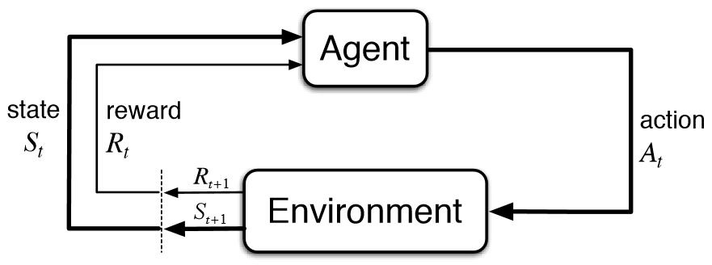
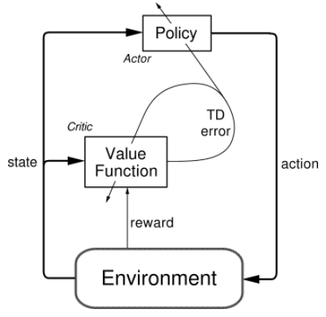

# 强化学习

## 模型概述

**强化学习**(Reinforce Learning, RL)模型由**代理**(Agent)和**环境**(Environment)组成

代理根据环境的**状态**(State)$s_t$采取**行动**(Action)$a_t$，环境相应地反馈一个**奖励**(Reward)并生成下一个状态$s_{t+1}$

重复这个过程，直到环境给出最终状态

## 马尔可夫决策过程

1. **马尔科夫决策过程**(Markov Decision Process, MDP)是强化学习问题的数学表述

2. MDP由一组对象$(\mathcal{S},\mathcal{A},\mathcal{R},\mathbb{P},\gamma)$定义

    * $\mathcal{S}$是可取的状态集

    * $\mathcal{A}$是可取的行动集

    * $\mathcal{R}$是奖励分布函数

    * $\mathbb{P}$是转移概率分布

    * $\gamma$是**折扣系数**(Discount factor)，用于在近期奖励和远期奖励上分配权重

3. MDP定义如下

    * 在初始时间$t=0$，从环境初始状态分布$p(s)$中采样初始状态$s_0\sim p(s)$

    * 从时间$t=0$开始直到终态：

        * 代理根据状态$s_t$采取策略$\pi$选择行动$a_t$

        * 环境根据状态$s_t$和行动$a_t$分别从奖励和状态的分布中采样$r_t\sim \mathcal{R}(.|s_t,a_t)$和$s_{t+1}\sim\mathbb{P}(.|s_t,a_t)$

        * 代理受到奖励$r_t$和状态$s_{t+1}$

4. 优化目标是找到最佳策略$\pi^*$，最大化配权后的奖励之和，即$$\pi^*=\arg\max_{\pi}\mathbb{E}\left[\sum_{t\ge0}\gamma^tr_t|\pi\right]$$

## 基于值的RL方法

1. 为了评估从状态$s$开始，采取行动$a$后，采用策略$\pi$的奖励，引入**Q值函数**(Q-value function)$$Q_\pi(s,a)=\mathbb{E}\left[\sum_{t\ge0}\gamma^tr_t|s_0=s,a_0=a,\pi\right]$$

    则Q值函数的最优值为$$Q^*(s,a)=\max_{\pi}\mathbb{E}\left[\sum_{t\ge0}\gamma^tr_t|s_0=s,a_0=a,\pi\right]$$

    最优值$Q^*$满足**贝尔曼方程**(Bellman Equation)，即$(s,a)$的最佳奖励$Q^*(s,a)$为该时间步的奖励$r$和下一个时间步取得的最佳奖励$Q^*(s',a')$之和$$Q^*(s,a)=\mathbb{E}_{s'\sim\varepsilon}\left[r+\gamma\max_{a'}Q^*(s',a')|s,a\right]$$

2. **Deep Q-Learning**(DQN)是**基于值**(Value-based)的RL方法，使用深度神经网络估计Q值函数来寻找最佳策略$$Q(s,a;\theta)\approx Q^*(s,a)$$

    最佳策略$\pi^*$就是取得最佳回报$Q^*$的策略

3. 前向传播

    $$L_i(\theta_i)=\mathbb{E}_{s,a\sim\rho(\cdot)}\left[y_i-Q(s,a;\theta_i)\right]^2$$其中$$y_i=\mathbb{E}_{s'\sim\varepsilon}\left[r+\gamma\max_{a'}Q(s',a';\theta_{i-1})|s,a\right]$$

    反向传播

    $$\nabla_{\theta_i}L_i(\theta_i)=\mathbb{E}_{s,a\sim\rho(\cdot);s'\sim\varepsilon}\left[r+\gamma\max_{a'}Q(s',a';\theta_{i-1}-Q(s,a;\theta_i))\nabla_{\theta_i}Q(s,a;\theta_i)\right]$$

4. 从序列化的采样中学习会导致效率低下，DQN采用**经验重放**(Experience replay)的策略来解决这个问题

    具体的做法是进行序列化采样，将每一个转移$(s_t, a_t, r_t, s_{t+1})$记录在**重放记忆表**(Replay memory table)中，每次从表中随机取出一个小批量的转移来训练网络

## 基于策略的RL方法

**策略梯度**(Policy gradient, PG)是**基于策略**(Policy-based)的RL方法，直接从一系列参数化策略$\prod=\left\{\pi_\theta,\theta\in\mathbb{R}^m\right\}$中学习最佳策略$\pi^*_\theta$

### 梯度推导

1. 定义每个策略的价值

    $$\begin{aligned}J(\theta)&=\mathbb{E}\left[\sum_{t\ge0}\gamma^tr_t|\pi_\theta\right]\\&=\mathbb{E}_{\tau\sim p(\tau;\theta)}[r(\tau)]\\&=\int_\tau r(\tau)p(\tau;\theta)d\tau\end{aligned}$$其中$\tau$是转移的轨迹$(s_0, a_0, r_0, s_1, \dots)$，$r(\tau)$是其对应的奖励

    优化目标是最大化策略的价值$$\theta^*=\arg\max_\theta J(\theta)$$

2. 求解$J(\theta)$的梯度

    $$\begin{aligned}\nabla_\theta J(\theta)&=\int_\tau r(\tau)\nabla_\theta p(\tau;\theta)d\tau\\&=\int_\tau r(\tau)p(\tau;\theta)\frac{\nabla_\theta p(\tau;\theta)}{p(\tau;\theta)}d\tau\\&=\int_\tau\left[r(\tau)\nabla_\theta\log p(\tau;\theta)\right]p(\tau;\theta)d\tau\\&=\mathbb{E}_{r\sim p(\tau;\theta)}[r(\tau)\nabla_\theta\log p(\tau;\theta)]\end{aligned}$$

3. 考虑$\tau$的概率分布$$p(\tau;\theta)=\prod_{t\ge0}p(s_{t+1}|s_t,a_t)\pi_\theta(a_t|s_t)$$

    两边取对数$$\log p(\tau;\theta)=\sum_{t\ge0}\log p(s_{t+1}|s_t,a_t)+\log\pi_\theta(a_t|s_t)$$

    其中前一项与$\theta$无关，求解其梯度$$\nabla_\theta\log p(\tau;\theta)=\sum_{t\ge0}\log\pi_\theta(a_t|s_t)$$

    因此$J(\theta)$的梯度可以被估算为$$\nabla_\theta J(\theta)\approx\sum_{t\ge0}r(\tau)\nabla_\theta\log\pi_\theta(a_t|s_t)$$

### 减少方差

1. PG依赖样本来优化策略，受个体样本差异影响很大，有很大的方差

2. 为了减少高方差的影响，一个思路是减少无效的项

    当前的行为不会对过去的奖励产生影响，因此仅仅累积未来的奖励

    $$\nabla_\theta J(\theta)\approx\sum_{t\ge0}\left(\sum_{t'\ge t}r_{t'}\right)\nabla_\theta\log\pi_\theta(a_t|s_t)$$

    引入折扣因子$\gamma$降低未来的影响

    $$\nabla_\theta J(\theta)\approx\sum_{t\ge0}\left(\sum_{t'\ge t}\gamma^{t'-t}r_{t'}\right)\nabla_\theta\log\pi_\theta(a_t|s_t)$$

3. 实际计算中的奖励并不能准确地反映出策略的好坏，因此引入一个基于状态的**基准**(Baseline)$b(s)$来评估选择某个行为的优势

    $$\nabla_\theta J(\theta)\approx\sum_{t\ge0}\left(\sum_{t'\ge t}\gamma^{t'-t}r_{t'}-b(s)\right)\nabla_\theta\log\pi_\theta(a_t|s_t)$$

    一个常用的基准是已经产生的奖励的平均值$$b(s)=\frac{1}{n}\sum_{i=0}^{t-1}r_i$$

## Actor-Critic

1. **Actor-Critic Algorithm**(A3C)结合了DQN和PG两个方法

    * PG扮演**Actor**角色，寻找最优策略$\pi_\theta^*$

    * DQN扮演**Critic**角色，通过Q值和价值函数来评估策略的选择

    

2. Critic使用**优势函数**(Advantage function)来评估根据策略$\pi$选择行为$a$的优势

    $$A_\pi(s,a)=Q_\pi(s,a)-V_\pi(s)$$

    其中**价值函数**(Value function)$V(s)$根据状态$s$和策略来评估获得的奖励

    $$V^\pi(s)=\mathbb{E}\left[\sum_{t\ge0}\gamma^tr_t|s_0=s,\pi\right]$$

    它与Q值函数以下关系$$Q_\pi(s,a)=r+\gamma V(s')$$

    因此优势函数可以写作$$A_\pi(s,a)=r+\gamma V(s')-V(s)$$

3. Actor根据Critic的优势函数定义策略价值的梯度

    $$\nabla_\theta J(\theta)\approx\sum_{t\ge0}A_\pi(s,a)\nabla_\theta\log\pi_\theta(a_t|s_t)$$