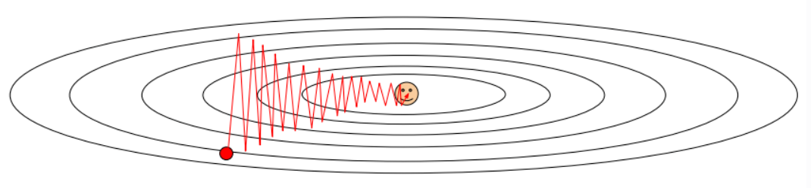
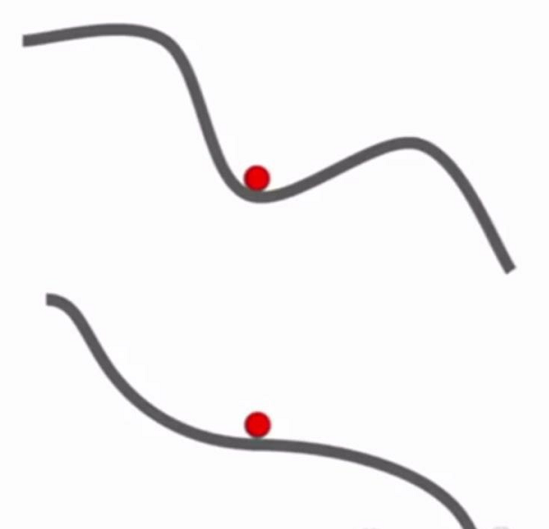
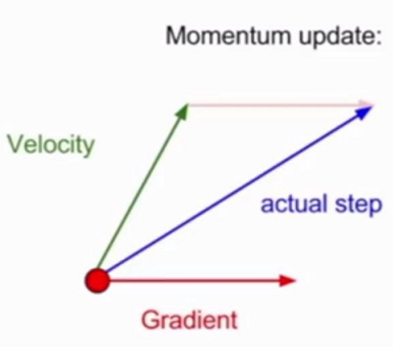
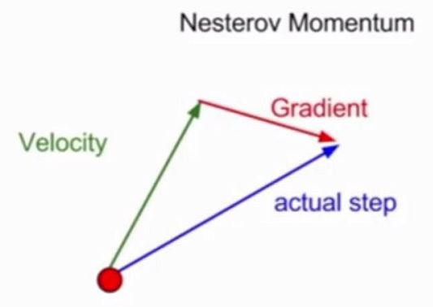
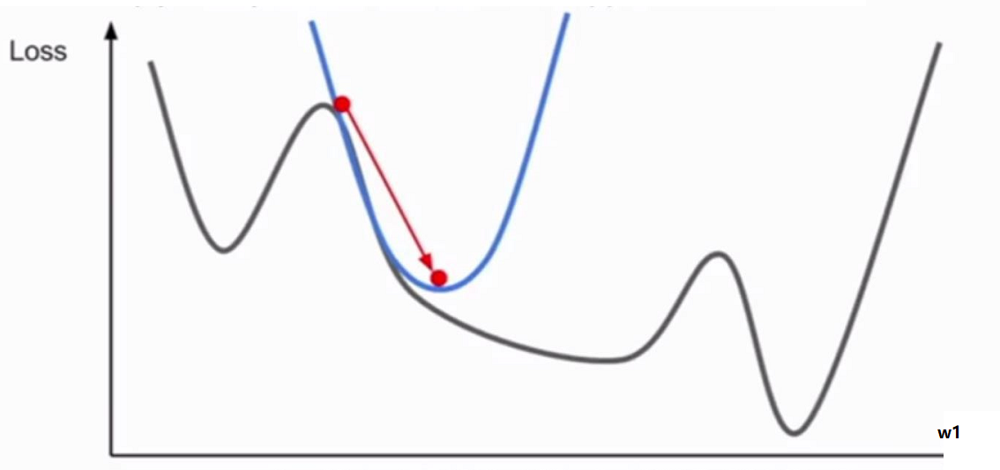

# 优化

## 概念

1. 损失函数可以量化基于特定权重$W$的模型质量，为了提高模型质量，寻找使得损失函数最小化的权重$W$的过程被称为**优化**(Optimization)

2. 一个流行的优化策略是沿着**梯度**(Gradient)的方向更新参数

    梯度是损失函数下降最快的方向

## 梯度计算

计算梯度有两个方法

* 数值梯度

* 分析梯度

后者耗费资源少，计算速度快，但是更容易出错

### 数值梯度

函数的偏导数定义为$$\frac{\partial f}{\partial x}=\lim_{h\rightarrow0}\frac{f(x+h)-f(x)}{h}$$

1. 根据定义，使用**有限差值**(Finite difference)计算函数的数值梯度

    ```python {.line-numbers}
    # evaluate the gradient numerically of function f at x

    def eval_numerical_gradient(f, x, h=1e-5):
        fx = f(x)
        grad = np.zeros(x.shape)

        # iterate over all dimension of point x
        for ix in x.shape[0]:
            old_value = x[ix]
            x[ix] += h
            fxh = f(x) # compute f(x + h)
            x[ix] = old_value

            grad[ix] = (fxh - fx) / h # compute partial derivative

        return grad
    ```

2. 在实践中，**中心差值公式**(Centered difference formula)被证明效果更好$$\lim_{h\rightarrow0}\frac{f(x+h)-f(x-h)}{2h}$$

    有限差值是对梯度的一阶泰勒近似，而中心差值公式是二阶泰勒近似

    ```python {.line-numbers}
    # evaluate the gradient numerically of function f at x
    # using center difference formula

    def eval_numerical_gradient(f, x, h=1e-6):
        fx = f(x)
        grad = np.zeros(x.shape)

        # iterate over all dimension of point x
        for ix in x.shape[0]:
            old_value = x[ix]
            x[ix] = old_value + h
            fxph = f(x) # compute f(x + h)
            x[ix] = old_value - h
            fxmh = f(x) # compute f(x - h)
            x[ix] = old_value # restore

            grad[ix] = (fxph - fxmh) / (2 * h) # center difference

        return grad
    ```

### 分析梯度

使用微分分析函数导数公式，根据公式计算梯度

## 梯度下降

沿着梯度的方向不断迭代更新权重$W$的方法称作**梯度下降**(Gradient Descent)$$x_{t+1}=x_t-\alpha\nabla f(x_t)$$

其中$\alpha$是每次每次迭代更新权重$W$的步长，称作**学习率**(Learning rate)

学习率是最重要的超参数之一

### 批量梯度下降

使用整个训练集来更新权重的策略称为**批量梯度下降**(Batch Gradient Descent, BGD)

```python {.line-numbers}
def gradient_descent(loss, x, w, lr=1e-3):
    while True:
        grad = eval_grad(loss, x, w)
        w += -lr * grad
```

### 小批量梯度下降

当训练集很大时，使用整个训练集来更新权重效率往往很低

一个常用的方法是，使用训练集中的一小部分来更新权重，这种策略称为**小批量梯度下降**(Mini-batch Gradient Descent, MGD)

```python {.line-numbers}
def MGD(loss, x, w, lr=1e-3, batch_size=256):
    while True:
        batch = get_data_batch(x, batch_size)
        grad = eval_grad(loss, batch, w)
        w += -lr * grad
```

小批量数据集的大小也是一个超参数，通常选择2的指数使运算更快

### 随机梯度下降

当每次只使用训练集中的一个样本来更新权重的策略称为**随机梯度下降**(Stochastic Gradient Descent, SGD)

通常也会使用SGD来指代小批量梯度下降

## 参数更新策略

### SGD的局限性

* 下降步长与梯度相关，有些维度梯度相差很大，使得下降步长相差很大，导致SGD下降时不断震荡，降低了收敛速度

    <div align="center"></div>
* SGD会被卡在**局部最优**(Local minima)或**鞍点**(Saddle point)附近，这些位置的梯度很接近于0

    <div align="center"></div>

    鞍点问题在高维问题中十分常见

* SGD每次更新只使用小批量数据，会被数据中的噪音影响

通常采用不同的更新策略来避免SGD的局限性

### Momentum

#### SGD+Momentum

1. 从物理的角度来看，将梯度类比势能，势能影响速度，速度最终影响位置$$\begin{aligned}v_{t+1}&=\rho v_t+\nabla f(x_t)\\x_{t+1}&=x_{t}-\alpha v_{t+1}\end{aligned}$$

2. 其中$\rho$是摩擦系数，它抑制了速度，使SGD最终能够停下来

    它是一个超参数，一个典型的设置是开始设置为0.5，随着不断迭代提升到0.99

3. 使用带Momentum的SGD优化算法后

    * 在不敏感的维度上加速，在敏感的维度上减速

    * 速度带来惯性，能够冲过局部最优或鞍点

4. 参考代码

    ```python {.line-numbers}
    def sgd_momentum(loss, x, w, lr=1e-3, rho=0.9):
        v = 0
        while True:
            dx = eval_grad(loss, x, w)
            v = rho * v - lr * dx
            x += v
    ```

#### Nesterov Momentum

1. 普通Momentum方法根据当前位置的梯度和动量方向混合的方向前进

    <div align="center"></div>

    而Nesterov Momentum采用一种略微不同的策略，先根据动量方向前进，再根据新位置的梯度前进

    <div style="float:left;width:50%"><div style="text-align:center"></div></div>


    $$\begin{aligned}\\\\v_{t+1}&=\rho v_t-\alpha\nabla f(x_t+\rho v_t)\\x_{t+1}&=x_t+v_{t+1}\\\\\\\end{aligned}$$

2. 为了获得标准形式，进行换元$\tilde{x}_t=x_t+\rho v_t$有$$\begin{aligned}v_{t+1}&=\rho v_t-\alpha\nabla f(\tilde{x}_t)\\\tilde{x}_{t+1}&=\tilde{x}_t-\rho v_t+(1+\rho)v_{t+1}\end{aligned}$$

3. 参考代码

    ```python {.line-numbers}
    def nesterov_momentum(loss, x, w, lr=1e-3, rho=0.9):
        v = 0
        while True:
            dx = eval_grad(loss, x, w)
            old_v = v
            v = rho * v - lr * dx
            x += -rho * old_v + (1 + rho) * v
    ```

### 学习率退火

1. 学习率直接影响优化速度和最终优化的损失函数位置

    * 若学习率较大，则下降速度快，但不能稳定到损失函数更深更窄的位置去

    * 若学习率较小，则下降速度慢，能够下降到更好的最优位置

    因此让学习率随时间退火可以提高优化效率和质量

2. 学习率退火的三种方式

    * 随步数衰减：每进行几个周期就降低学习率

    * 随指数衰减$$\alpha=\alpha_0e^{-kt}$$其中$\alpha_0$和$k$都是超参数，$t$是迭代周期

    * 1/t衰减$$\alpha=\frac{\alpha_0}{1+kt}$$其中$\alpha_0$和$k$都是超参数，$t$是迭代周期

    在实践中，更常用随步数衰减的学习率退火方法

### 适应性学习率方法

#### AdaGrad

1. AdaGrad跟踪了每个参数梯度平方和，并用平方和归一化学习率来更新参数

2. 这使得较大梯度的维度更新效果被减弱，而较小梯度的维度更新效果被加强

    此外学习率也会随时间下降

3. 参考代码

    ```python {.line-numbers}
    def adagrad(loss, x, w, lr=1e-3, eps=1e-8):
        grad_squared = 0
        while True:
            dx = eval_grad(loss, x, w)
            grad_squared += dx ** 2
            x -= lr * dx / (np.sqrt(grad_squared) + eps)
    ```

#### RMSProp

1. RMSProp对AdaGrad进行了改进，使用梯度平方和的滑动平均来替代简单的平方和

2. 和AdaGrad不同，这样的更新不会使学习率单调减小

3. 参考代码

    ```python {.line-numbers}
    def rmsprop(loss, x, w, lr=1e-3, eps=1e-8, decay=0.9)
        grad_squared = 0
        while True:
            dx = eval_grad(loss, x, w)
            grad_squared = decay * grad_squared + (1 - decay) * dx ** 2
            x -= lr * dx / (np.sqrt(grad_squared) + eps)
    ```

    其中`decay`是超参数，通常设置为0.9或0.99

#### Adam

1. Adam在RMSProp的基础上加上了Momentum

    ```python {.line-numbers}
    def adam(loss, x, w, lr=1e-3, eps=1e-8, beta1=0.9, beta2=0.99):
        first_moment = 0
        second_moment = 0
        while True:
            dx = eval_grad(loss, x, w)
            first_moment = beta1 * first_moment + (1 - beta1) * dx
            second_moment = beta2 * second_moment + (1 - beta2) * dx ** 2
            x -= lr * first_moment / (np.sqrt(second_moment) + eps)
    ```

2. 为了防止Adam在初始化后存在的偏差，完整的Adam算法使用无偏估计引入了矫正机制

    ```python {.line-numbers}
    def adam(loss, x, w, lr=1e-3, eps=1e-8, beta1=0.9, beta2=0.99):
        first_moment = 0
        second_moment = 0
        while True:
            dx = eval_grad(loss, x, w)
            first_moment = beta1 * first_moment + (1 - beta1) * dx
            second_moment = beta2 * second_moment + (1 - beta2) * dx
            first_moment /= (1 - beta1 ** t)
            second_moment /= (1 - beta2 ** t)
            x -= lr * first_moment / (np.sqrt(second_moment) + eps)
    ```

    超参数`beta1`、`beta2`和学习率通常设置为0.9、0.99和`1e-3`

## 二阶优化算法

1. 使用二次函数逼近损失函数，然后下降到二次函数最低点的优化方法称作**二阶优化方法**(Second-Order Optimization)

    <div align="center"></div>

    最常用的二阶优化方法基于牛顿迭代法$$x\leftarrow x-[Hf(x)]^{-1}\nabla f(x)$$其中$Hf(x)$是海森矩阵，即$f(x)$的二阶偏导数平方组成的矩阵

2. 计算海森矩阵的逆，特别是在深度网络有上百万参数的情况下，是不可行的

    因此在实践中更多地使用**拟牛顿法**(quasi-Newton)来近似求逆，一个比较流行的算法是**L-BFGS**

3. 在深度网络中，二阶优化方法是不常见的，因为诸如L-BFGS方法无法像SGD一样简单地使用小批量进行计算，效率偏低
