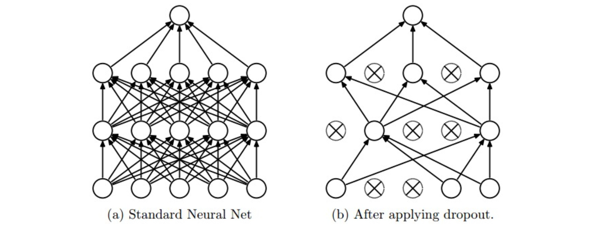

# 正则化

## 概念

1. 在训练时向模型引入随机性，添加噪音来防止**过拟合**(Overfit)训练数据$$y_{train}=f_W(x,z)$$

    在推理时抵消随机性$$y_{infer}=f(x)=E_z[f(x,z)]=\int p(z)f(x,z)dz$$

    这种提高模型**泛化能力**(Generalization)的方法称作**正则化**(Regularization)

2. 常用的正则化方法

    * 在损失函数中添加**正则化惩罚**(Regularization penalty)$R(W)$项

        通常只对权重$W$进行正则化，而不对偏差$b$进行正则化

    * **随机失活**(Dropout)：在训练时随机使神经元失活

    * **批量标准化**(Batch normalization)：在训练时使用随机batch

    * **数据增强**(Data augmentation)：在训练时以某种方式随机变换数据

## 正则化损失

1. **L2正则化**(L2 Regularization)更倾向于使用所有输入的特征，而不是依赖特征中的某些小部分$$R(W)=\sum_k\sum_lW_{k,l}^2$$

2. **L1正则化**(L1 Regularization)更倾向于关注输入特征中的一个稀疏子集$$R(W)=\sum_k\sum_l|W_{k,l}|$$

3. **弹性网络正则化**(Elastic net Regularization)组合了L1正则化和L2正则化$$R(W)=\sum_k\sum_l\beta W_{k,l}^2+|W_{k,l}|$$

4. **最大范式约束**(Max norm constraints)通过给神经元权重的量级设定上限，并对梯度下降进行投影来确保约束$$||w||_2<c$$一般$c$选取3或者4

## Dropout

1. Dropout是一种应用于网络中的正则化方法，它让神经元以超参数$p$的概率被激活或者被设置为0来约束权重，通常$p$取0.5

    <div align="center"></div>

2. 使用Dropout可以认为是从完整的网络中抽取出一部分子集，每次只更新子网络的权重

    最终得到的是多个子网络的模型集成

3. 假设某个神经元输出为$x$，则应用Dropout后输出应该变为$$px + (1 - p)0 = px$$为了在推断时抵消这种随机性，要对输出结果乘以$p$

    ```python {.line-numbers}
    # An example of Dropout in 3-layer Neural Network

    p = 0.5 # probability of keeping a neuron active

    def train(X):
        # forward pass
        H1 = np.maximum(0, np.dot(W1, X) + b1) # ReLu
        U1 = np.random.rand(*H1.shape) < p
        H1 *= U1 # dropout

        H2 = np.maximum(0, np.dot(W2, H1) + b2)
        U2 = np.random.rand(*H2.shape) < p
        H2 *= U2

        out = np.dot(W3, H2) + b3

        # backward pass ...
        # perfrom parameter update ...

    def predict(X):
        H1 = np.maximum(0, np.dot(W1, X) + b1) * p
        H2 = np.maximum(0, np.dot(W2, H1) + b2) * p
        out = np.dot(W3, H2) + b3

        return out
    ```

4. 为了保证更好的推断性能，在训练阶段直接对数据范围进行调整，这样被称为**反向随机失活**(Inverted dropout)

    ```python {.line-numbers}
    # An example of Inverted Dropout in 3-layer Neural Network

    p = 0.5 # probability of keeping a neuron active

    def train(X):
        H1 = maximum(0, np.dot(H1, X) + b1)
        U1 = (np.random.rand(*H1.shape) < p) / p # drop and scale during train time
        H1 *= U1

        H2 = maximum(0, np.dot(H2, W1) + b2)
        U2 = (np.random.rand(*H2.shape) < p) / p
        H2 *= U2

        out = np.dot(W3, H2) + b3

        # backward pass ...

    def predict(X):
        H1 = np.dot(W1, X) + b1
        H2 = np.dot(W2, H1) + b2
        out = np.dot(W3, H2) + b3

        return out
    ```

## 数据增强

1. 在计算机视觉领域，数据增强在训练时对输入图像进行随机变换但不改变标签

    这些变换包括

    * 随机翻转

    * 随机裁切

    * 色彩抖动

2. 在推断时，会对输入图形进行固定的变换来抵消随机性

    通常是四个角落和中心的裁切和翻转
