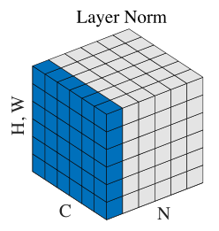

# 标准化

## 问题提出

1. 在网络模型中，每一层参数的更新都会影响到高层的输入分布，输入分布的不断改变导致了模型学习的不稳定，降低了学习效率，这种现象称作**Internal Covariate Shift**

2. **标准化**(Normalization)的核心思想是通过标准化激活值的分布来减少Internal Covariate Shift的影响

    具体做法是在网络中加入Norm层，使用对激活值均值和方差的估计来标准化激活值

    

    Norm层通常位于全连接层或卷积层后，对线性变化后的激活值进行标准化后进行非线性变换

## 通用标准化模式

### 标准化公式

考虑一个激活值的集合，其中下标$i$对于二维图片是一个四维向量$i=(i_N, i_C, i_H, i_W)$，分别对应数据集的大小、图片的通道和尺寸$$\{a_i|i\in S_i\}$$

对其进行标准化变换$$\hat{a}_i=\frac{1}{\sigma_i}(a_i-\mu_i)$$其中$\mu$和$\sigma$分别对应激活值的均值和标准差$$\begin{aligned}\mu_i&=\frac{1}{m}\sum_{k\in S_i}a_k\\\sigma_i&=\sqrt{\frac{1}{m}\sum_{k\in S_i}(a_i-\mu_i)^2+\epsilon}\end{aligned}$$

标准化后将激活值的分布平移、缩放为均值为0，方差为1的标准正态分布$\hat{a}$

### 再缩放和再拉伸

标准化后使得输入被限制到了一个固定的范围，降低了模型的表达能力

通过引入了两个可学习参数$\gamma$和$\beta$对输入分布进行再平移和再缩放，恢复模型的表达能力

$$y_i=\gamma\hat{a_i}+\beta$$

### 梯度求导

1. 求解梯度$\frac{\partial L}{\partial a_i}$

    $$\begin{aligned}\frac{\partial L}{\partial\hat{a}_i}&=\frac{\partial L}{\partial y_i}\gamma\\\frac{\partial L}{\partial\sigma_B^2}&=\sum_{i=1}^{m}\frac{\partial L}{\partial\hat{a}_i}\frac{\partial\hat{a}_i}{\partial\sigma_B^2}\\&=\sum_{i=1}^m\frac{\partial L}{\partial\hat{a}_i}(a_i-\mu_B)\frac{\partial}{\partial \sigma_B^2}(\frac{1}{\sqrt{\sigma_B^2+\epsilon}})\\&=-\frac{1}{2}\sum_{i=1}^m\frac{\partial L}{\partial \hat{a}_i}(a_i-\mu_B)(\sigma_B^2+\epsilon)^{-3/2}\\\frac{\partial L}{\partial\mu_B}&=\sum_{i=1}^m\frac{\partial L}{\partial\hat{a}_i}\frac{\partial\hat{a}_i}{\partial\mu_B}\\&=\sum_{i=1}^m\frac{\partial L}{\partial\hat{a}_i}\left[\frac{\partial}{\partial\mu_B}\left(\frac{a_i}{\sqrt{\sigma_B^2+\epsilon}}\right)-\frac{\partial}{\partial\mu_B}\left(\frac{\mu_B}{\sqrt{\sigma^2_B+\epsilon}}\right)\right]\\&=\sum_{i=1}^m\frac{\partial L}{\partial\hat{a}_i}\left[\frac{1}{2}(\mu_B-a_i)(\sigma_B^2+\epsilon)^{-3/2}\frac{\partial\sigma_B^2}{\partial\mu_B}-\frac{1}{\sqrt{\sigma_B^2+\epsilon}}\right]\\&=\sum_{i=1}^m\frac{\partial L}{\partial\hat{a}_i}\left[\frac{1}{m}(a_i-\mu_B)(\sigma_B^2+\epsilon)^{-3/2}\sum_{i=1}^m(a_i-\mu_B)-\frac{1}{\sqrt{\sigma_B^2+\epsilon}}\right]\\&=\left(-\sum_{i=1}^m\frac{\partial L}{\partial\hat{a}_i}\frac{1}{\sqrt{\sigma_B^2+\epsilon}}\right)-\frac{2}{m}\frac{\partial L}{\partial\sigma_B^2}\sum_{i=1}^m(a_i-\mu_B)\\\frac{\partial L}{\partial a_i}&=\frac{\partial L}{\partial\hat{a}_i}\frac{\partial\hat{a}_i}{\partial a_i}\\&=\frac{\partial L}{\partial\hat{a}_i}\left[\frac{\partial}{\partial a_i}\left(\frac{a_i}{\sqrt{\sigma_B^2+\epsilon}}\right)-\frac{\partial}{\partial a_i}\left(\frac{\mu_B}{\sqrt{\sigma^2_B+\epsilon}}\right)\right]\\&=\frac{\partial L}{\partial\hat{a}_i}\frac{1}{\sqrt{\sigma_B^2+\epsilon}}+\frac{2}{m}\frac{\partial L}{\partial\sigma_B^2}(a_i-\mu_B)+\frac{1}{m}\frac{\partial L}{\partial\mu_B}\end{aligned}$$

2. 求解梯度$\frac{\partial L}{\partial\gamma}$

    $$\frac{\partial L}{\partial\gamma}=\sum_{i=1}^m\frac{\partial L}{\partial y_i}\hat{a}_i$$

3. 求解梯度$\frac{\partial L}{\partial\beta}$
    $$\frac{\partial L}{\partial\beta}=\sum_{i=1}^m\frac{\partial L}{\partial y_i}$$

## 标准化策略

### Batch Normalization

1. **Batch Normalization**(BN)使用一个批量数据的统计量作为估计进行标准化$$S_i=\{k|k_C=i_C\}$$

    

2. BN的训练和推理过程不一致

    在推理过程中，输入只有一个实例，无法通过一个实例计算均值和方差

    因此在使用训练时每个批量的统计量的无偏估计平均值作为总体统计量进行标准化$$\begin{aligned}E(a)&=\text{avg}(E_B[\mu_B])\\Var(a)&=\text{avg}\left(\frac{m}{m-1}E_B[\sigma_B^2]\right)\end{aligned}$$那么$$\begin{aligned}y&=\gamma\hat{a}+\beta\\&=\frac{\gamma}{\sqrt{Var(a)+\epsilon}}a+\left(\beta-\frac{\gamma E(a)}{\sqrt{Var(a)+\epsilon}}\right)\end{aligned}$$

3. BN的局限性

    * BN效果受到数据批量大小的影响

        * 批量小时，对总体的统计量估计误差大，BN效果差

        * 批量大时，BN效果好，但是消耗大量内存

        特别地，当批量大小为1时无法进行BN操作

    * 无法直接应用在RNN中

### Layer Normalization

1. **Layer Normalization**(LN)使用每一层中所有神经元的统计量作为估计对单一实例在该层的激活值进行标准化$$S_i=\{k|k_N=i_N\}$$

    

2. LN的局限性

    * 在CV领域，特别是CNN中的效果不好

### Group Normalization

**Group Normalization**(GN)将输入的通道进行分组，使用每一层组内所有神经元的统计量作为估计值对单一实例在该层的激活值进行标准化$$S_i=\{k|k_N=i_N,\lfloor\frac{k_C}{C/G}\rfloor=\lfloor\frac{i_C}{C/G}\rfloor\}$$

