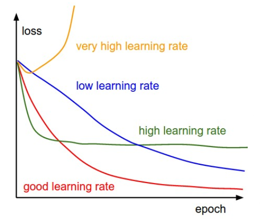
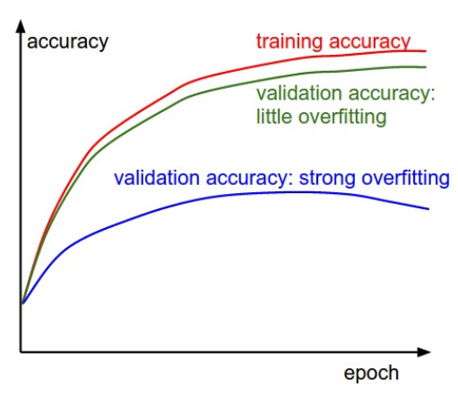
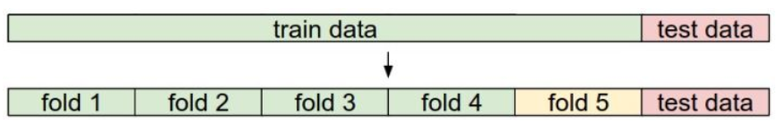
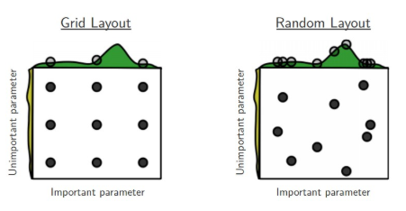

# 训练策略

## 合理性检查

在训练之前，要对模型进行**合理性检查**(Sanity check)来确保模型实现的正确性

### 梯度检查

1. 将数值梯度计算的结果与分析梯度计算的结果进行比较，来检测梯度计算的正确性的过程称为**梯度检查**(Gradient check)

2. 使用数值梯度和分析梯度的相对误差来进行比较差距$$\frac{|f'_a-f'_n|}{\max(|f'_a|,|f'_n|)}$$

    对于一层的反向传播，小于`1e-7`说明梯度实现正确

    但对于多层神经网络，相对误差会随着网络深度不断累积

3. 在实践中，进行梯度检查要注意的问题

    * 使用双精度浮点数

    * 步长$h$太小会导致数值精度问题

        通常设置为`1e-4`或者`1e-6`

    * 若梯度太小，使用常数将损失函数的范围扩展到更大的范围

        比较理想的是1.0的数量级上

    * 计算不可导点附近的数值梯度，步长$h$可能越过不可导点导致错误

        一个解决方法是使用更少的数据，数据越少，不可导点越少，而计算更加高效

    * 为了防止正则化吞没数据，先关闭正则化进行检查然后再对正则化单独检查

    * 在梯度检查时要关闭网络中不确定效果的操作，如Dropout和Augmentation

### 其他策略

1. 预估初始损失值

    如对于使用Softmax分类器的模型，在不引入正则化惩罚的情况下其初始值约为$$-\log\frac{1}{C}$$其中$C$是分类数

2. 在小数据集上训练并过拟合

## 监视学习过程

1. 跟踪损失曲线

    <div align="center"></div>

    根据损失曲线的形状来调整学习率

    若曲线的稳定性差，即噪音太多，调整SGD中的批大小

2. 跟踪模型在测试集和验证集上的准确率

    <div align="center"></div>

    训练准确率和验证准确率差距说明了模型过拟合的程度，调整模型的正则化

3. 检测参数与参数更新的级别

    ```python {.line-numbers}
    param_scale = np.linalg.norm(W.ravel())
    update = -lr *dW
    update_scale = np.linalg.norm(update.ravel())
    print(update_scale / param_scale)
    ```

    通常`1e-3`是一个合理的值，若大于这个值则学习率过大，反之过小

## 超参数调优

### 超参数

1. 在机器学习算法设计中，**超参数**(Hyperparameter)是在训练之前设置值的参数，而不是能够通过训练学习到的参数

2. 选择超参数的过程称为超参数调优

### 验证集

1. 为了提高提高模型的**泛化能力**(Generalization)，通常从整个数据集中选取一部分作为**验证集**(Validation set)对超参数进行调优

2. 当数据集较小时，将训练集平均分为$n$份，其中$n-1$份用来训练，剩下一份用来验证的方法称为**交叉验证**(Cross validation)

    <div align="center"></div>

    通常使用一个验证集是更好的选择

### 超参数搜索

1. 确定搜索范围的量级

    一些参数如学习率在对数尺度上进行搜索

    ```python {.line-numbers}
    learning_rate = 10 ** np.random.uniform(-6, 1)
    ```

    另一些参数在普通的尺度上进行搜索

    ```python {.line-numbers}
    dropout = np.random.uniform(0, 1)
    ```

2. 采用随机搜索策略

    <div align="center"></div>

3. 从粗到细的分阶段范围搜索
