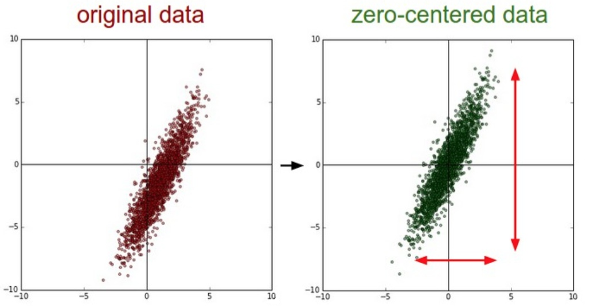
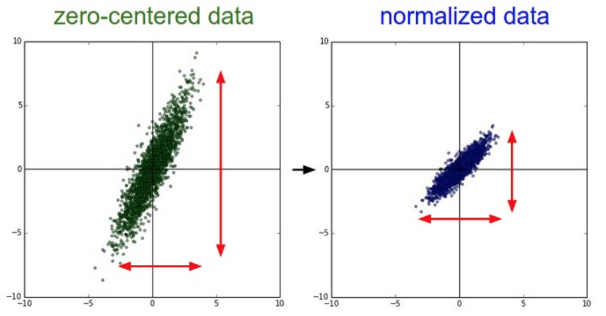
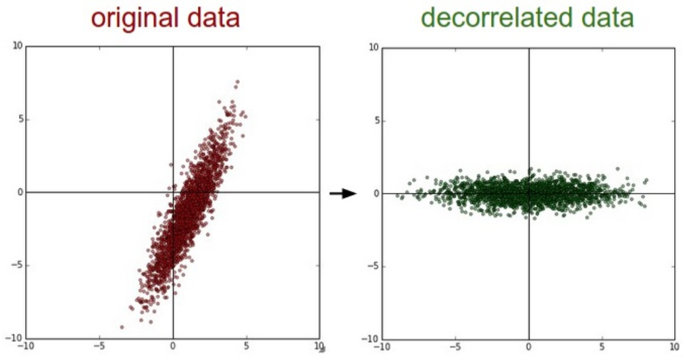
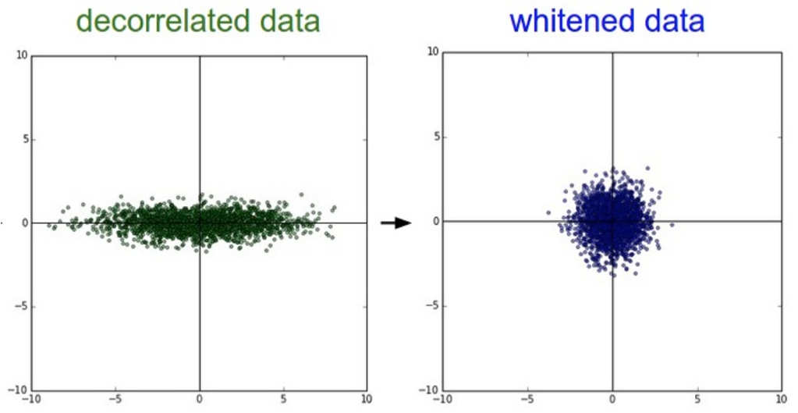

# 预处理与初始化

## 预处理

### 零均值化

1. **零均值化**(Mean subtraction)对数据中每个独立特征减去它的均值，从几何上可以理解为在每个维度上将数据云的中心迁移到原点，如图

    <div align="center"></div>

2. 在图像预处理中，通常将所有像素都减去全部像素的均值，当然也可以在3个颜色通道上分别处理

### 归一化

1. **归一化**(Normalization)将数据的所有维度都缩放到同一范围内，通常的做法是将每个维度都除以它的标准差，如图

    <div align="center"></div>

2. 只有输入特征有不同的范围才会进行归一化处理，而因为图像像素的范围都是一致的(0-255)，因此没有必要对图片进行归一化处理

### PCA降维

1. **主成分分析法**(Principle Components Analysis, PCA)是一种常见的**降维**算法(Dimensionality reduction)，它尝试在保留数据尽可能多信息的同时降低数据的相关性，如图

    <div align="center"></div>

2. PCA算法通过**奇异值分解**(Singular value decomposition, SVD)来对特征协方差矩阵正交对角化，此时协方差矩阵对角线上方差最大，而协方差最小

    然后选取特征向量的前$K$维进行线性变换，将源数据映射到低维空间中来对数据降维

3. 进行过PCA降维的数据往往有很好的性能，且能大大缩小训练时间和存储空间

### 白化

1. **白化**(Whitening)操作基于特征向量映射后的线性空间，通过除以特征值以零为中心来归一化数据范围，如图

    <div align="center"></div>

2. 白化操作的一个缺点是会夸大数据集中的噪音，因为它将所有的维度都拉伸到同一范围，这些维度中可能包含大量噪音的维度，通常会在特征值上加上一个偏差来解决

### 注意事项

1. 通常在卷积神经网络中，不会进行PCA和白化操作

2. 任何预处理操作都应该在划分后的训练集数据上进行，然后应用到验证集/训练集

    而不是先预处理再划分数据集

## 初始化

### 对称权重

1. 将所有权重初始化为0或是其他相同的值会导致**对称权重**(Weight space symmetry)问题

2. 相同的权重意味着所有神经元都计算出相同的输出，然后在反向传播中计算出相同的梯度，进而进行相同的权重更新，这使得神经元之间失去了不对称性

### 小随机数初始化

1. 为了打破对称性，使用服从高斯分布的小随机数对权重进行初始化

    ```python {.line-numbers}
    W = 0.01 * np.random.randn(D, H)
    ```

2. 数值越小并不一定能得到更好的结果，因为权重小会导致计算的梯度小，在深度网络中会出现问题

### Xavier初始化化

1. 随着输入数据量的增长，随机初始化的神经元的输出数据分布的方差也会增大$$\begin{aligned}D(Wx)&=D(\sum_i^nw_ix_i)\\&=\sum_i^nDw_ix_i\\&=\sum_i^n\left[E^2(w_i)Dx_i+E^2(x_i)Dw_i+Dx_iDw_i\right]\\&=\sum_i^nDx_iDw_i\\&=(nDW)Dx\end{aligned}$$其中假设$x$和$W$均值都为0，因此$Ex_i=Ew_i=0$

2. 为了使神经元的输入输出方差相等，根据推导必须保证在初始化时权重的方差为原来的$\frac{1}{n}$，即初始化时乘以$\sqrt{\frac{1}{n}}$

    ```python {.line-numbers}
    W = 0.01 * np.random.randn(D, H) / np.sqrt(D)
    ```

3. 使用ReLU的神经元均值并不为0，因此上述推导不成立

    ReLU神经元的方差为原来的$\frac{2}{n}$，即初始化时乘以$\sqrt{\frac{2.0}{n}}$

    ```python {.line-numbers}
    W = 0.01 * np.random.randn(D, H) * np.sqrt(2 / D)
    ```

