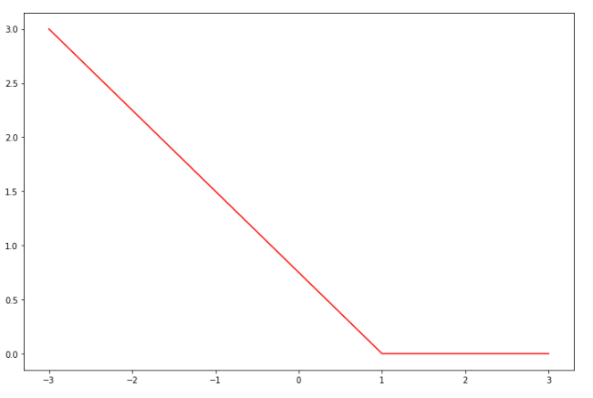

# 线性分类器

## 评价函数

1. **线性分类器**(Linear classifier)中使用线性映射作为评价函数$$f(x_i, W, b) = Wx_i + b$$其中$W$称为**权重**(Weights)，$b$称为**偏差**(Bias)

    通常将$W$和$b$合二为一，并$x_i$增加一个偏差维度，这样公式化简为$$f(x_i, W) = Wx_i$$

2. 可以将线性分类看作一个模版匹配的过程，学习得到的权重$W$的每一行对应一个类别的模版，如下图

    

    然后通过使用内积来比较样本和模版的差距来寻找最相似的标签，但对于一个类别，线性分类器只能学习到一个模版，因此对于图片识别效果不佳

## 多分类SVM分类器

### 损失函数

1. **支持向量机**(Support Vector Machine, SVM)的损失函数希望SVM正确分类的得分始终比不正确分类的得分高出一个边界值$\Delta$

2. 定义第$i$个样本的损失函数为$$\begin{aligned}L_i&=\sum_{j\neq y_i}\begin{cases}0 & f_{y_i}\geq f_j+\Delta\\f_j-f_{y_i}+\Delta&otherwise\end{cases}\\&=\sum_{j\neq y_i}\max(0,f_j-f_{y_i}+\Delta)\end{aligned}$$其中$f_j$表示第$i$个样本第$j$类的得分，$f_{y_i}$表示第$i$个样本正确类别的得分$$f_j=f(x_i, W)_j$$

3. 取$\Delta=1$，则该函数的图像为

因此该函数被称作**合页损失函数**(hinge loss function)

4. 完整的SVM损失函数由**数据损失**和**L2正则化损失**组成$$\begin{aligned}L&=\frac{1}{N}\sum_iL_i+\lambda R(W)\\&=\frac{1}{N}\sum_i\sum_{j\neq y_i}\max(0, f_j-f_{y_i}+\Delta)+\lambda\sum_k\sum_lW_{k,l}^2\end{aligned}$$引入L2惩罚后，SVM有了**最大间隔**这一特性

### 梯度推导

1. 当$j\neq y_i$时$$\begin{aligned}\frac{\partial L_i}{\partial W_j}&=\frac{\partial\left[\max(0,f_1-f_{y_i}+\Delta)+\dots+\max(0,f_K-f_{y_i}+\Delta)\right]}{\partial W_j}\\&=\frac{\partial\max(0,f_j-f_{y_i}+\Delta)}{\partial W_j}\\&=\begin{cases}x_i&f_j-f_{y_i}+\Delta>0\\0&f_j-f_{y_i}+\Delta\leq0\end{cases}\\&=1(f_j-f_{y_i}+\Delta>0)x_i\end{aligned}$$其中$1(P)$是**指示函数**(Indicator function)，若$P$为真结果为1，反之为0

2. 当$j=y_i$时$$\begin{aligned}\frac{\partial L_i}{\partial W_{y_i}}&=\frac{\partial\left[\max(0,f_1-f_{y_i}+\Delta)+\dots+\max(0,f_K-f_{y_i}+\Delta)\right]}{\partial W_{y_i}}\\&=-\sum_{j\neq y_i}1(f_j-f_{y_i}+\Delta>0)x_i\end{aligned}$$

综上

1. 当$j\neq y_i$时$$\frac{\partial L}{\partial W_j}=\frac{1}{N}\sum_i1(f_j-f_{y_i}+\Delta>0)x_i+2\lambda W_j$$

2. 当$j=y_i$时$$\frac{\partial L}{\partial W_j}=-\frac{1}{N}\sum_i\sum_{j\neq y_i}1(f_j-f_{y_i}+\Delta>0)x_i+2\lambda W_j$$

## Softmax分类器

**Softmax分类器**是逻辑回归分类器对多分类问题的一般化归纳

### 损失函数

1. Softmax分类器将评价函数的得分解释为没有归一化的对数概率

    通过**Softmax函数**可以将得分转化为归一化的分类概率$$g_j(z)=\frac{e^{z_j}}{\sum_ke^{z_k}}$$

2. Softmax分类器使用**交叉熵损失**(Cross-entropy loss)定义第$i$个样本的损失$$\begin{aligned}L_i&=-\log g_{y_i}\left[f(x_i, W)\right]\\&=-\log\frac{e^{f_{y_i}}}{\sum_je^{f_j}}\end{aligned}$$为了保证指数运算的**数值稳定性**，在损失函数上添加偏置项$C$，在数学上是等价的$$\begin{aligned}L_i&=-\log\frac{Ce^{f_{y_i}}}{C\sum_je^{f_j}}\\&=-\log\frac{e^{f_{y_i}+\log C}}{\sum_je^{f_j+\log C}}\end{aligned}$$通常选取$\log C=-\max f_k$

3. 引入正则化惩罚后，完整的Softmax损失函数为$$\begin{aligned}L&=\frac{1}{N}\sum_iL_i+\lambda R(W)\\&=-\frac{1}{N}\sum_i\log\frac{e^{f_{y_i}-\max f_k}}{\sum_je^{f_j-\max f_k}}+\lambda\sum_k\sum_lW_{k,l}^2\end{aligned}$$

### 梯度推导

$$L_i=-f_{y_i}+\log\sum_je^{f_j}$$对$L_i$求导有$$\frac{\partial L_i}{\partial W_k}=-\frac{\partial f_{y_i}}{\partial W_k}+\frac{\partial\log\sum_je^{f_j}}{\partial W_k}$$其中$W_k$表示第$k$类的权重

前一项$$\begin{aligned}\frac{\partial f_{y_i}}{\partial W_k}&=\frac{\partial W_{y_i}x_i}{\partial W_k}\\&=\begin{cases}x_i&k=y_i\\0&k\neq y_i\end{cases}\end{aligned}$$后一项$$\begin{aligned}\frac{\partial\log\sum_je^{f_j}}{\partial W_k}&=\frac{1}{\sum_je^{f_j}}\frac{\partial(e^{f_1} +\dots+e^{f_K})}{\partial W_k}\\&=\frac{1}{\sum_je^{f_j}}\frac{\partial e^{f_k}}{\partial W_k}\\&=\frac{e^{f_k}}{\sum_je^{f_j}}\frac{\partial W_kx_i}{\partial W_k}\\&=g_k[f(x_i, W)]x_i\end{aligned}$$综上

1. 当$k=y_i$时$$\frac{\partial L}{\partial W_k}=\frac{1}{N}\sum_i\left\lbrace g_k[f(x_i, W)]-1\right\rbrace x_i+2\lambda W_k$$

2. 当$k\neq y_i$时$$\frac{\partial L}{\partial W_k}=\frac{1}{N}\sum_ig_k[f(x_i, W)]x_i+2\lambda W_k$$