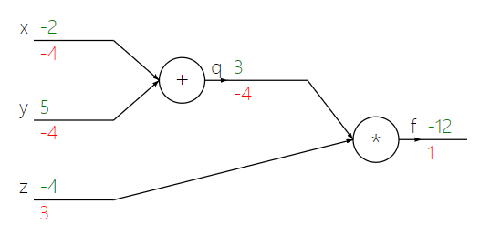

# 反向传播

## 前向传播

1. **计算图**将函数$f$的每一小步分解成不同**门单元**(Gate)，这些门单元互相独立

2. 可以将任何可微函数看做门单元，可以将多个门组合成一个门，也可以将一个函数分拆成多个门

3. 按照计算图从输入节点计算到输出节点的过程称之为**前向传播**(Forward propagation)

## 反向传播

1. 一旦前向传播完毕，从尾部开始反向计算梯度一直到图的输入端，这个过程称为**反向传播**(Backward propagation)

2. 根据**链式法则**(Chain rule)，门单元将传回的梯度乘以它对其输入的局部梯度，单元输入值的梯度$$\frac{\partial f}{\partial x}=\frac{\partial f}{\partial h}\frac{\partial h}{\partial x}$$其中$h$是输入$x$通过门单元计算得到的中间变量

    最终可以得到整张图对输入的梯度$\nabla f$

3. 根据多元链式法则，如果一个变量在图中分支走向不同的部分，那么梯度在回传时应该进行累加

## 实例

表达式$$f(x, y, z) = (x + y)z$$可以分解为不同门单元组成的计算图

<div align="center"></div>

其中绿色为前向传播计算结果，红色为反向传播计算的梯度

```python {.line-numbers}
# forward pass and backward pass

x = -2
y = 5
z = -4

# forward pass
q = x + y
f = q * z

# backward pass
dfdz = q * 1.0
dfdq = z * 1.0
dfdx = 1.0 * dfdq
dfdy = 1.0 * dfdq
```